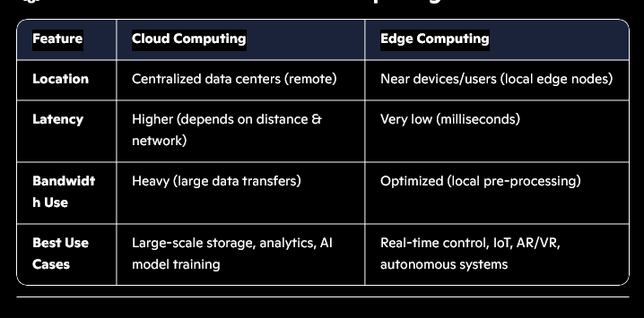
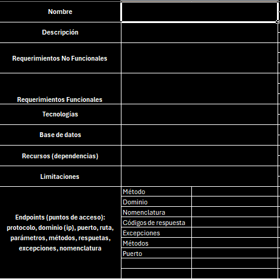

# ANE Frequency Monitoring & Signal Intelligence API

## Project Vision & Strategic Objectives
This project aims to deliver a high-performance, distributed API system for the Software Defined Radio (SDR) monitoring network across Colombia. By leveraging Edge Computing, Event-Driven Microservices, and Machine Learning, the system provides real-time signal intelligence, automated anomaly detection, and massive-scale spectral data analysis.

---

## 1. Requirements Engineering (RE)
*Inspired by Sommerville's Software Engineering principles.*

### 1.1 Stakeholder Analysis
- **National Spectrum Agency (ANE):** Primary client for spectrum regulation and monitoring.
- **Field Engineers:** Operators of distributed SDR nodes.
- **Signal Analysts:** Users of the dashboard and automated alerting system.
- **Security Teams:** Monitors for unauthorized frequency occupation and anomalies.

### 1.2 Functional Requirements (FR)
- **FR-01: Real-time Data Ingestion:** System must ingest spectral samples from >100 distributed nodes simultaneously.
- **FR-02: Signal Detection:** Identify peaks and anomalies within predefined frequency ranges.
- **FR-03: Automated Alerting:** Dispatch notifications via SMS/Email when unauthorized activity is detected.
- **FR-04: ML Preprocessing:** Use unsupervised learning for noise reduction and supervised models for pattern matching.

### 1.3 Non-Functional Requirements (NFR)
- **Latency:** Detection-to-alert latency must be $< 2$ seconds.
- **Scalability:** Horizontal scaling of ingestion and detection services.
- **Retention:** Raw data retention for 6 months; metadata/detections stored indefinitely.
- **Throughput:** Capable of handling millions of samples per second via partitioning.

*Referenced External Requirements:* `../../content/APIrequirements/detailed_reqs.png`

---

## 2. System Architecture
We adopt a multi-tier **Conceptual → Logical → Physical** design approach to ensure separation of concerns and system maintainability.

### 2.1 Conceptual Design (High-Level Intelligence)
The system acts as a distributed nervous system for RF spectrum monitoring.

- **SDR Nodes (The Sensors):** Capture raw RF signals and perform initial processing.
- **The Core (API & Microservices):** Orchestrates data flow, storage, and intelligence.
- **The Edge (Processing Layer):** Pure C implementation on Raspberry Pi/Edge devices to minimize backhaul bandwidth.

### 2.2 Logical Design (Formal Component Model)
An **Event-Driven Microservices Architecture** ensures the system remains decoupled and highly available.

- **Ingestion Pipeline:** SDR → Edge Processing (FFT) → MQTT/Kafka Broker → Storage Service.
- **Parallel Intelligence Branch:** Message Broker → ML Detection Service → Alert Service.
- **API Gateway:** Centralized entry point for Client Applications (Angular Dashboard).

---

## 3. Core Technical Components

### 3.1 Edge Computing & Processing (SDR Agent)
To optimize performance, the Fast Fourier Transform (FFT) and initial filtering are performed at the edge using **Pure C** on Raspberry Pi devices. This reduces the data footprint by sending processed spectrum samples rather than raw IQ data.

- **Protocol:** TCP/UDP for raw streams; JSON/UDC for processed metadata.
- **Buffering:** Local ring-buffers to prevent data loss during network jitter.

### 3.2 Microservices Ecosystem
| Service | Responsibility | Tech Stack |
| :--- | :--- | :--- |
| **Ingestion** | Stream processing and schema validation | Node.js / FastAPI |
| **ML Detection** | Anomaly detection & Signal ID | Python (Scikit-learn, PyTorch) |
| **Alerting** | Multi-channel notification dispatch | Node.js (RabbitMQ/Kafka) |
| **Admin** | Node management & RBAC | NestJS |
| **Monitoring** | System health & Pipeline telemetry | Prometheus / Grafana |

### 3.3 Data Strategy & Persistence
The system utilizes **PostgreSQL** with time-series partitioning to handle massive datasets efficiently.

- **Partitioning Strategy:** Monthly tables (e.g., `measurements_2026_05`) to maintain index performance.
- **Indexing:** BRIN (Block Range Index) for time-series and B-Tree for metadata.
- **Storage:** Metadata in Relational DB; Raw high-frequency samples in specialized Time-Series DB (TSDB) or Object Storage (S3).

---

## 4. Professional Implementation & Deployment

### 4.1 Development Lifecycle
We follow an **Agile/SCRUM** methodology with CI/CD integration.
1. **Environment:** WSL2, Docker, Kubernetes.
2. **Backend:** Node.js (Express/NestJS) for the REST API; Python for ML.
3. **Frontend:** Angular for the Real-time Dashboard (WebSockets).

### 4.2 CI/CD Pipeline
- **Continuous Integration:** Automated unit testing (Jest/Mocha) and linting.
- **Continuous Deployment:** Dockerized containers deployed to a staging/production cluster via GitHub Actions.

### 4.3 Observability & Security
- **Security:** OAuth2/JWT for authentication; TLS for data in transit; Rate limiting at the Gateway.
- **Observability:** Centralized logging (ELK Stack) and real-time metrics (Prometheus).

---

## 5. Deployment Roadmap
1. **Infrastructure Setup:** Provisioning DB, Message Broker (Kafka), and Registry.
2. **Database Implementation:** Schema creation, partitioning logic, and indexing.
3. **API Implementation:** Developing core endpoints and UDC (Universal Data Communication) validation.
4. **ML Integration:** Model training with historical spectral data and microservice deployment.
5. **Frontend Delivery:** Interactive map-based dashboard and spectral visualization.

---

## 6. Validation & Finalization
The project is considered production-ready when:
- **Load Testing:** System sustains >10,000 requests/sec with <500ms latency.
- **Detection Accuracy:** ML models achieve >95% precision in signal identification.
- **Resilience:** Successful failover test for the database and message broker.
- **Deployment:** Full containerized deployment across the monitoring network.

---
*Created by the ANE Engineering Team. Expert Design & Professional Implementation.*
